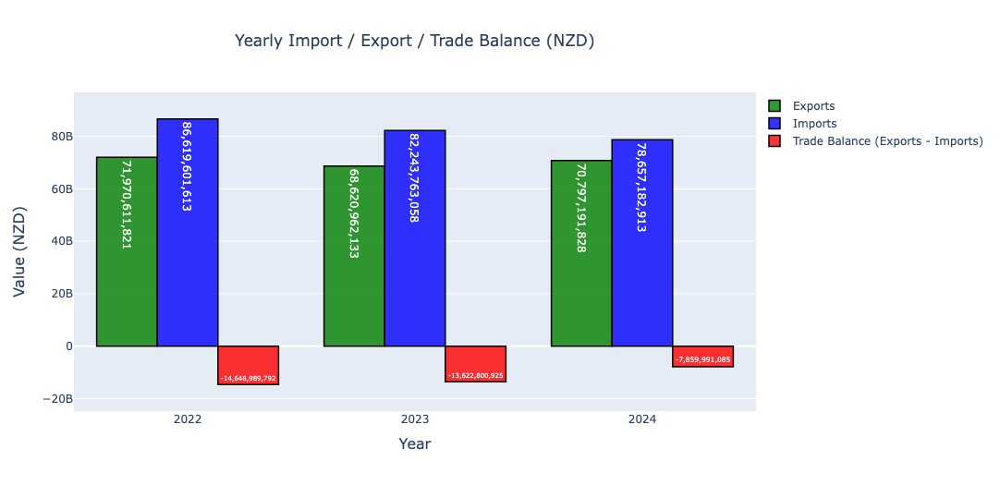

# new-zealand-trade-analysis
Analysis of New Zealand's export and import trade data from 2022-2024
# New Zealand Trade Data Analysis (2022-2024)

## Overview
This project looks at New Zealand's import and export trends from 2022 to 2024.

The main goals were to:
*   Find the trade balance for each year.
*   Identify the top trading partner countries.
*   Identify the top commodity types being traded.
  
## Dataset Used

*   **Data Source:** Stats NZ - Overseas Merchandise Trade datasets.
*   **Analysis Platform:** The data was analyzed using Kaggle.
*   **Kaggle Notebook Link:** [https://www.kaggle.com/code/eikonixon/analysis-on-new-zealand-import-export]
*   **Period Covered:** 2022 - 2024.
*   **Contents:** The dataset includes monthly information on Harmonized System (HS) codes, trading partner countries, and trade values.

## Technologies & Libraries Used

*   **Programming Language:** Python
*   **Data Manipulation:** Pandas
*   **Data Visualization:** Matplotlib, Seaborn, Plotly
*   **Analysis Environment:** Kaggle Notebooks

## Analysis Steps

### Step 1: Data Loading and Preprocessing

#### 1.1 Data Loading
First, I loaded CSV files for exports and imports for the years 2022, 2023, and 2024.
After loading each file, I added a 'year' column to identify the year for each record.
Then, I combined all the yearly export data into one main table (DataFrame) called `df_exports_all`. I did the same for the import data, creating a table called `df_imports_all`.

#### 1.2 Initial Data Check and Cleaning

After loading the data, the first step was to understand its structure.
*   **Checked Data Types and Missing Values:** I used `df.info()` to see what type of data was in each column (e.g., text, numbers) and to check if any data was missing (null values).

#### 1.3 Dropping Unnecessary Columns

Next, I removed columns that were not needed for this analysis. This helped to make the data tables cleaner and easier to work with. The columns I removed included:
*   Blank columns that appeared after importing the CSV files (like 'Unnamed: 12', 'Unnamed: 13').
*   Quantity-related columns (like 'Unit Qty', 'Exports Qty') because this analysis focuses on the monetary value of trade.

After removing these columns, I checked `df.info()` again to make sure all remaining columns had data (non-null count).

#### 1.4 Converting Monetary Values to Numbers

A very important step was to change the monetary value columns into a format that could be used for calculations. Columns like 'Exports ($NZD fob)', 'Re-exports ($NZD fob)', 'Total Exports ($NZD fob)', 'Imports ($NZD vfd)', and 'Imports ($NZD cif)' were originally text (`object` type) because they contained commas.

To fix this:
*   I removed the commas from all these money value columns.
*   Then, I converted these cleaned text values into whole numbers (`int` type).

### Step 2: Yearly Trade Analysis (2022-2024)

To understand the overall trade performance, the total export value, total import value, and trade balance (exports minus imports) were calculated for each year from 2022 to 2024.

#### 2.1 Data Aggregation
To get a yearly summary, I first calculated the total trade values for each year from 2022 to 2024.
*   **Yearly Exports:** I grouped the `df_exports_all` data by 'year' and then summed up the 'Total Exports ($NZD fob)' to get the total export value for each year.
*   **Yearly Imports:** I did the same for the `df_imports_all` data, grouping by 'year' and summing 'Imports ($NZD cif)' to get the total import value for each year.
*   **Combined Summary & Trade Balance:** After getting these yearly totals, I merged the export and import totals into a single summary table, using the 'year' to match them. From this table, I calculated the 'Trade Balance' for each year by subtracting the total import value from the total export value. This shows whether New Zealand had a trade surplus (more exports than imports) or a deficit (more imports than exports) each year.

#### 2.2 Visualization and Insights
To visualize these yearly figures, I created a grouped bar chart using Plotly.
*   The **x-axis** of the chart represented the years (2022, 2023, 2024).
*   The **y-axis** represented the monetary values in NZD.
*   For each year, the chart displayed three bars side-by-side: one for total exports, one for total imports, and one for the trade balance.

Below is the chart showing the yearly trade summary:

**Key Observations from the Chart:**
*   **Exports:** Export values remained relatively similar across the three years (2022-2024).
*   **Imports:** Import values showed a decreasing trend over this period.
*   **Trade Balance:**
    *   New Zealand experienced a trade deficit (imports were higher than exports) in all three years (2022, 2023, and 2024).
    *   However, the trade deficit appeared to be improving (getting smaller) over time, likely due to the decrease in import values.

The interactive version of this chart and the code to generate it can be found in the [Kaggle Notebook]({kaggle_notebook_link_here}). 
