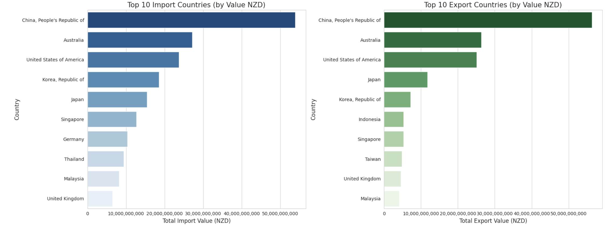
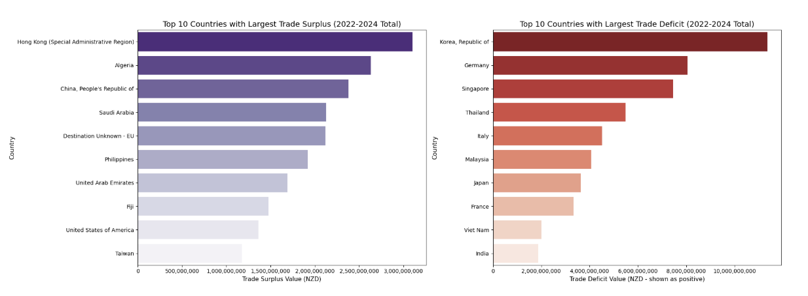
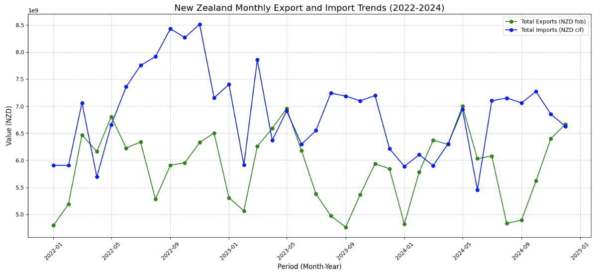
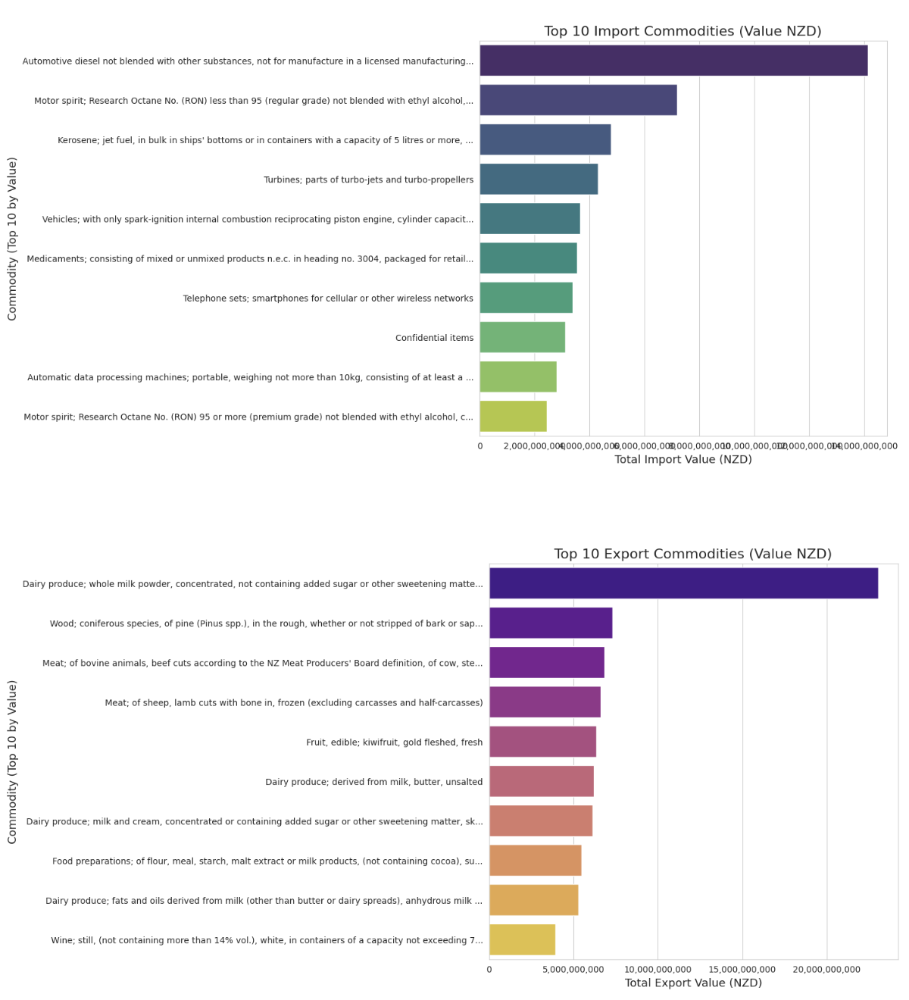
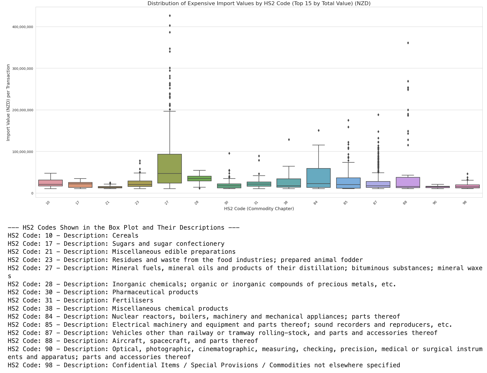

# New Zealand Trade Data Analysis (2022-2024)

## Overview
This project looks at New Zealand's import and export trends from 2022 to 2024.

The main goals were to:
*   Find the trade balance for each year.
*   Identify the top trading partner countries.
*   Identify the top commodity types being traded.
  
## Dataset Used

*   **Data Source:** Stats NZ - Overseas Merchandise Trade datasets.
*   **Analysis Platform:** The data was analyzed using Kaggle.
*   **Kaggle Notebook Link:** [https://www.kaggle.com/code/eikonixon/analysis-on-new-zealand-import-export]
*   **Period Covered:** 2022 - 2024.
*   **Contents:** The dataset includes monthly information on Harmonized System (HS) codes, trading partner countries, and trade values.

## Technologies & Libraries Used

*   **Programming Language:** Python
*   **Data Manipulation:** Pandas
*   **Data Visualization:** Matplotlib, Seaborn, Plotly
*   **Analysis Environment:** Kaggle Notebooks

## Analysis Steps

### Step 1: Data Loading and Preprocessing

#### 1.1 Data Loading
First, I loaded CSV files for exports and imports for the years 2022, 2023, and 2024.
After loading each file, I added a 'year' column to identify the year for each record.
Then, I combined all the yearly export data into one main table (DataFrame) called `df_exports_all`. I did the same for the import data, creating a table called `df_imports_all`.

#### 1.2 Initial Data Check and Cleaning

After loading the data, the first step was to understand its structure.
*   **Checked Data Types and Missing Values:** I used `df.info()` to see what type of data was in each column (e.g., text, numbers) and to check if any data was missing (null values).

#### 1.3 Dropping Unnecessary Columns

Next, I removed columns that were not needed for this analysis. This helped to make the data tables cleaner and easier to work with. The columns I removed included:
*   Blank columns that appeared after importing the CSV files (like 'Unnamed: 12', 'Unnamed: 13').
*   Quantity-related columns (like 'Unit Qty', 'Exports Qty') because this analysis focuses on the monetary value of trade.

After removing these columns, I checked `df.info()` again to make sure all remaining columns had data (non-null count).

#### 1.4 Converting Monetary Values to Numbers

A very important step was to change the monetary value columns into a format that could be used for calculations. Columns like 'Exports ($NZD fob)', 'Re-exports ($NZD fob)', 'Total Exports ($NZD fob)', 'Imports ($NZD vfd)', and 'Imports ($NZD cif)' were originally text (`object` type) because they contained commas.

To fix this:
*   I removed the commas from all these money value columns.
*   Then, I converted these cleaned text values into whole numbers (`int` type).

### Step 2: Yearly Trade Analysis (2022-2024)

To understand the overall trade performance, the total export value, total import value, and trade balance (exports minus imports) were calculated for each year from 2022 to 2024.

#### 2.1 Data Aggregation
To get a yearly summary, I first calculated the total trade values for each year from 2022 to 2024.
*   **Yearly Exports:** I grouped the `df_exports_all` data by 'year' and then summed up the 'Total Exports ($NZD fob)' to get the total export value for each year.
*   **Yearly Imports:** I did the same for the `df_imports_all` data, grouping by 'year' and summing 'Imports ($NZD cif)' to get the total import value for each year.
*   **Combined Summary & Trade Balance:** After getting these yearly totals, I merged the export and import totals into a single summary table, using the 'year' to match them. From this table, I calculated the 'Trade Balance' for each year by subtracting the total import value from the total export value. This shows whether New Zealand had a trade surplus (more exports than imports) or a deficit (more imports than exports) each year.

#### 2.2 Visualization and Insights
To visualize these yearly figures, I created a grouped bar chart using Plotly.
*   The **x-axis** of the chart represented the years (2022, 2023, 2024).
*   The **y-axis** represented the monetary values in NZD.
*   For each year, the chart displayed three bars side-by-side: one for total exports, one for total imports, and one for the trade balance.

Below is the chart showing the yearly trade summary:

**Key Observations from the Chart:**
*   **Exports:** Export values remained relatively similar across the three years (2022-2024).
*   **Imports:** Import values showed a decreasing trend over this period.
*   **Trade Balance:**
    *   New Zealand experienced a trade deficit (imports were higher than exports) in all three years (2022, 2023, and 2024).
    *   However, the trade deficit appeared to be improving (getting smaller) over time, likely due to the decrease in import values.

The interactive version of this chart and the code to generate it can be found in the [Kaggle Notebook]({kaggle_notebook_link}). 

### Step 3: Analysis of Top Trading Partner Countries (2022-2024 Aggregate)

To understand New Zealand's key trading relationships, I identified the top trading partner countries based on the total value of trade over the entire 2022-2024 period.

#### 3.1 Identifying Top Countries
*   **Top Import Countries:** I grouped the `df_imports_all` data by 'Country' and summed the 'Imports ($NZD cif)' for all three years. Then, I sorted these totals in descending order to find the top 10 countries from which New Zealand imported the most.
*   **Top Export Countries:** I followed the same process for the `df_exports_all` data, grouping by 'Country' and summing the 'Total Exports ($NZD fob)' to identify the top 10 export destination countries.

#### 3.2 Visualization and Insights
I created side-by-side horizontal bar charts using Matplotlib and Seaborn to display the top 10 import countries and top 10 export countries. Horizontal bar charts were chosen as they make it easy to read country names and compare the values.

**Key Observations from the Top Trading Partners Chart:**
*   **Dominant Partner - China:** China was consistently the number one trading partner for New Zealand for both imports and exports over the 2022-2024 period. Notably, the trade value with China was approximately twice that of the second-ranked partner, Australia, indicating a significant reliance on China for New Zealand's trade.
*   **Key Regional Partners:** Australia was the second-largest trading partner, followed by the USA as the third, for both imports and exports.
*   **Other Significant Asian Partners:** Japan and South Korea also featured prominently in the top 5 for both import sources and export destinations, with their exact rankings slightly varying between imports and exports (Japan was 4th for imports and 5th for exports; South Korea was 5th for imports and 4th for exports).

The code for this country-level aggregation and visualization can be found in the [Kaggle Notebook]({kaggle_notebook_link}).

### Step 4: Trade Balance with Key Countries (2022-2024 Aggregate)

This step aimed to identify countries with which New Zealand has significant trade surpluses (exporting more than importing) and significant trade deficits (importing more than exporting) over the total 2022-2024 period.

#### 4.1 Calculating Country-Specific Trade Balances
To achieve this:
1.  I first calculated the total value of all exports to each country over the three years (2022-2024) by grouping the `df_exports_all` data by 'Country' and summing the 'Total Exports ($NZD fob)'.
2.  Similarly, I calculated the total value of all imports from each country over the three years from the `df_imports_all` data.
3.  Then, for each country, I subtracted its total import value from its total export value to determine the trade balance.

#### 4.2 Identifying Top Surplus and Deficit Countries
*   **Top Surplus Countries:** I sorted the countries by their trade balance in descending order (largest positive balance first) to find the top 10 countries with which New Zealand had the largest trade surplus.
*   **Top Deficit Countries:** I sorted the countries by their trade balance in ascending order (largest negative balance first, or smallest positive) to find the top 10 countries with which New Zealand had the largest trade deficit.

#### 4.3 Visualization and Insights

**Key Observations from Trade Balances with Specific Countries:**
*   **Top Surplus Generating Countries:**
    *   The largest trade surplus for New Zealand was with **Hong Kong**.
    *   The second largest surplus was with **Algeria**, which was an interesting finding.
    *   **China**, despite being the overall top trading partner, ranked third in terms of generating a trade surplus for New Zealand.
*   **Top Deficit Incurring Countries:**
    *   New Zealand had its largest trade deficit with **South Korea**.
    *   The second largest deficit was with **Germany**.
    *   The third largest deficit was with **Sigapore**. 
*   **Notable Absences:** It was interesting to note that Australia and the USA, New Zealand's second and third largest overall trading partners respectively, did not appear among the top countries for either the largest surpluses or largest deficits. This suggests a more balanced trade relationship with them in terms of direct export-import values, or that their large total trade volume is composed of many offsetting transactions.

The code for these calculations can be found in the [Kaggle Notebook]({kaggle_notebook_link}). 

### Step 5: Monthly Export and Import Trends (2022-2024)

To get a more detailed view of trade fluctuations, I analyzed the export and import trends on a monthly basis from January 2022 to December 2024. The main goal was to see if there were any seasonal patterns or specific monthly variations.

#### 5.1 Data Preparation for Monthly Analysis
*   Using the 'Period' column (Month-Year), I grouped both the `df_exports_all` and `df_imports_all` data.
*   For each month, I summed the 'Total Exports ($NZD fob)' to get the total monthly export value.
*   Similarly, I summed the 'Imports ($NZD cif)' for each month to get the total monthly import value.
    
#### 5.2 Visualization and Insights
I created a line chart using Matplotlib to plot these monthly export and import values over the three-year period.
*   The **x-axis** represented the 'Period' (Month-Year).
*   The **y-axis** represented the monetary values in NZD.
*   Two lines were plotted: one for total monthly exports (in green) and one for total monthly imports (in blue).

   

**Key Observations from the Monthly Trends Chart:**
*   **Opposite Seasonal Peaks:** An interesting pattern emerged where peak import months often coincided with lower export months, and vice-versa.
    *   For example, August, September, and October appeared to be high seasons for imports, while exports were relatively lower during these months.
    *   Conversely, May showed a peak for exports but appeared to be a lower period for imports.
*   **General Trend Confirmation:** The line chart generally showed that monthly import values (the blue line) were often higher than monthly export values (the green line). This aligns with the overall trade deficit observed in the yearly summary.

### Step 6: Analysis of Top Traded Commodities (2022-2024 Aggregate)

This step focused on identifying the specific commodity categories that accounted for the highest trade values for both imports and exports over the 2022-2024 period.

#### 6.1 Identifying Top Commodities
*   I used the 'Harmonised System Description' column to identify the different commodities.
*   **Top Import Commodities:** For imports, I grouped the `df_imports_all` data by 'Harmonised System Description' and summed the 'Imports ($NZD cif)' for all three years. The results were then sorted in descending order to get the top 10 most valuable import commodities.
*   **Top Export Commodities:** The same process was applied to the `df_exports_all` data, summing 'Total Exports ($NZD fob)' for each commodity description to find the top 10 export commodities.

#### 6.2 Visualization and Insights
Due to the often long names in 'Harmonised System Description', I created separate vertical bar charts using Matplotlib and Seaborn for imports and exports. To ensure readability:
*   Commodity names on the y-axis were shortened to a maximum character length if they exceeded this limit.
*   Chart margins were adjusted to properly fit the labels.   

**Key Observations from Top Traded Commodities:**

**Top Import Commodities:**
*   The leading import commodities were largely **vehicles and machinery-related items**.
*   The top 5 imports included categories such as: Automotive diesel, Motor spirit, Kerosene/Jet fuel, Turbines, Vehicles.
*   Notably, the value of the top import commodity was more than double that of the second-ranked import commodity, indicating very high demand for this specific category.

**Top Export Commodities:**
*   New Zealand's top export commodities were predominantly **primary sector products, especially food items**.
*   The top 5 exports included: Dairy produce (milk powder), Wood, Meat of bovine animals (beef), Meat of sheep", "Fruits.
*   The top export commodity (likely dairy produce) showed exceptionally high demand, with its total value being more than three times that of the second top export.
*   This aligns with New Zealand's international reputation as a major producer and exporter of dairy products.

The code for identifying and visualizing these top commodities can be found in the [Kaggle Notebook]({kaggle_notebook_link_}). 

### Step 7: Analysis of High-Value Single Trade Transactions (2022-2024)

Beyond looking at aggregate totals, I also investigated individual trade transactions with exceptionally high monetary values. This helps to understand what specific deals contribute significantly to the overall trade figures.

#### 7.1 Identifying High-Value Single Transactions
*   **Threshold Setting:** To identify these significant transactions, a single import or export deal was considered "high-value" if its transaction value exceeded 10,000,000 NZD.
*   **Top Transactions:** After filtering for these high-value transactions, I examined the top 10 most expensive single import deals and top 10 most expensive single export deals by sorting them by their transaction value.

**Key Observations from Top 10 Single Expensive Transactions:**

*   **Imports (Top 10 Single Deals):**
    *   The most expensive single import transactions were dominated by **Automotive diesel** (primarily from South Korea and Singapore), **Aeroplanes and other aircraft** (from the USA), and various **Oils** (from the UAE).
    *   This suggests that large, individual shipments of machinery, vehicles, and fuel products represent some of the highest value single import events.
    *   It was noted that all of the top 10 single import transactions significantly exceeded 100 million NZD in value, highlighting the scale of these individual deals.
      
  *   **Here are some of the top individual high-value import transactions:**
        1.  **Automotive Diesel:**   ~426M NZD from South Korea (Jan 2023)
        2.  **Automotive Diesel:**   ~403M NZD from South Korea (Sep 2022)
        3.  **Automotive Diesel:**   ~386M NZD from South Korea (Jul 2024)
        4.  **Aeroplanes/Aircraft:** ~361M NZD from USA (Sep 2024)
        5.  **Automotive Diesel:**   ~347M NZD from Singapore (Jan 2023)
        6.  **Oils:**                ~340M NZD from UAE (Jan 2022)
        7.  **Automotive Diesel:**   ~301M NZD from South Korea (Nov 2022)
        8.  **Oils:**                ~294M NZD from UAE (Feb 2022)
        9.  **Automotive Diesel:**   ~282M NZD from South Korea (Aug 2024)
        10. **Automotive Diesel:**   ~276M NZD from South Korea (Aug 2022)

*   **Exports (Top 10 Single Deals):**
    *   All of the top 10 most expensive single export transactions were destined for **China**.
    *   The commodities involved were primarily **Dairy produce** and **Wood**. This aligns with the findings from the aggregate top export commodity and top export country analyses, reinforcing the importance of these products and this market for high-value exports.

 *   **Here are some of the top individual high-value export transactions:**
        
        1.  **Dairy Produce (Whole Milk Powder):** ~347M NZD to China (Mar 2022)
        2.  **Dairy Produce (Whole Milk Powder):** ~321M NZD to China (Dec 2024)
        3.  **Dairy Produce (Whole Milk Powder):** ~306M NZD to China (Dec 2022)
        4.  **Wood:**                              ~302M NZD to China (Nov 2022)
        5.  **Dairy Produce (Whole Milk Powder):** ~268M NZD to China (Feb 2024)

#### 7.2 Commodity and Country Concentration in *All* High-Value Deals

To understand broader patterns within *all* transactions exceeding the 10,000,000 NZD threshold (not just the top 10 single deals), I analyzed the frequency of commodities and countries involved.

**Concentration in High-Value Imports:**
*   **Most Frequent Commodities (by number of >10M NZD import deals):**
    1.  Confidential items
    2.  Automotive diesel
    3.  Medicaments (Pharmaceuticals)
    4.  Turbines
    5.  Motor spirit (Petrol/Gasoline)
*   **Most Frequent Countries (by number of >10M NZD import deals):**
    1.  China
    2.  Japan
    3.  Australia
    4.  USA
    5.  South Korea
*   **Insight:** The high frequency of 'Automotive diesel' deals, coupled with the large individual values seen in the top 10 single transactions, could be a significant driver of overall import values, particularly if many such deals occurred in periods like 2022 when total imports were highest.

**Concentration in High-Value Exports:**
*   **Most Frequent Commodities (by number of >10M NZD export deals):**
    1.  Dairy produce (Whole milk powder, high fat)
    2.  Dairy produce (Skimmed milk powder)
    3.  Dairy produce (Anhydrous milk fat)
    4.  Meat of sheep (lamb cuts with bone in, frozen)
    5.  Dairy produce (Unsalted butter)
*   **Most Frequent Countries (by number of >10M NZD export deals):**
    1.  China
    2.  USA
    3.  Australia
    4.  Japan
    5.  South Korea
*   **Insight:** The concentration of frequent high-value export deals largely mirrors the overall top trading partners, with China, the USA, Australia, Japan and South Korea being key destinations. This indicates that New Zealand's most significant export relationships are also characterized by a substantial number of large individual transactions, primarily in dairy and meat products. While the single largest-value deals are heavily skewed towards China, these other top partners also consistently engage in high-value trade.

The code for identifying these high-value transactions and their characteristics can be found in the [Kaggle Notebook]({kaggle_notebook_link}).

#### 7.3 Distribution of High-Value Transaction Amounts by Commodity Chapter (HS2 Code)

To further understand the characteristics of the high-value transactions (those exceeding 10,000,000 NZD for both imports and exports), I examined the distribution of their monetary values across different broad commodity chapters (HS2 Codes).

**Methodology:**
*   The 'HS2_Code' (first two digits of the Harmonized System Code, representing the commodity chapter) was used to categorize these high-value transactions.
*   Box plots were generated using Matplotlib and Seaborn to visualize the distribution (median, quartiles, range, and outliers) of transaction values. This was done for the top 15 HS2 chapters (ranked by the total value of expensive transactions within each chapter) to ensure the chart remained readable.
*   Alongside each box plot, a list mapping the HS2 codes to their chapter descriptions was provided for clarity.

**High-Value Import Transaction Distribution:**

**Key Insights from the Box Plots:** 

*   **For High-Value Imports:**
    *   **HS2 Chapter '27' (Mineral fuels, mineral oils, etc.):** This chapter, which includes significant imports like automotive diesel, displayed the largest interquartile range (the "box" itself was big). This indicates a wide variation in the values of its high-value transactions. Furthermore, it showed outliers across a very broad range, highlighting that some individual fuel/oil shipments were exceptionally expensive compared to the typical range of other high-value deals within this chapter.
    *   **HS2 Chapter '84' (Machinery and mechanical appliances, etc.):** This chapter also showed a considerable spread in its high-value transaction amounts (being the second biggest box). However, it had fewer extreme outliers compared to Chapter '27', suggesting that while the values of expensive machinery imports varied, they were generally more consistent without as many exceptionally high-value single deals.
    *   **HS2 Chapter '88' (Aircraft, spacecraft, and parts thereof):** Expensive transactions in this chapter also showed a notable spread. The presence of several outliers with a wide range indicates that a few specific aircraft or high-value parts purchases were significantly more costly than other expensive transactions in this category.

**High-Value Export Transaction Distribution:**

*   **For High-Value Exports:**
    *   **HS2 Chapter '04' (Dairy produce; etc.):** While Dairy is a top export, its box plot for high-value transactions (deals > 10M NZD) showed a relatively smaller box. This suggests that the middle 50% of expensive dairy deals have values that are somewhat more consistent with each other. However, Chapter '04' was characterized by numerous outliers extending over a very wide and high range of values, indicating the presence of many exceptionally large single export deals for dairy products.

    *   **HS2 Chapter '44' (Wood and articles of wood):** This chapter displayed a large and long box, with the median positioned towards the lower end. The long whiskers and the large interquartile range indicate a **high degree of variability in the values of individual high-value wood export transactions**, with no extreme outliers beyond this wide range. This wide variation might reflect differing volumes, types, or destinations of wood shipments.

    *   **HS2 Chapter '02' (Meat and edible meat offal):** High-value meat exports showed a relatively large box (larger than dairy's), with its median also skewed towards the lower end of the box. The whiskers were longer than dairy's, and there were notable outliers spread over a significant range. This suggests that while many expensive meat transactions occur, some deals, potentially for **premium cuts or larger shipments, achieve exceptionally higher values.**

    *   **HS2 Chapter '08' (Edible fruit and nuts):** This chapter presented a smaller box for its high-value transactions, with the median again towards the lower end. However, it featured long whiskers and some outliers. This pattern could suggest that while many expensive fruit deals fall within a certain range, **seasonal factors or shipments of higher-value fruits likely contribute to transactions with significantly larger values** at certain times or for specific fruit types.

    *   *(Optional: Add one more observation about another prominent chapter from your export box plot, e.g., Chapter 22 Wine, Chapter 29 Organic Chemicals, or Chapter 76 Aluminium, and describe its box, median, whiskers, and outliers.)*
This analysis helps to pinpoint which broad categories of goods are driving the very large single transactions and how varied those transaction values are within each category. The detailed code for creating these box plots is in the [Kaggle Notebook]({your_kaggle_notebook_link_here}). *(Replace link)*
